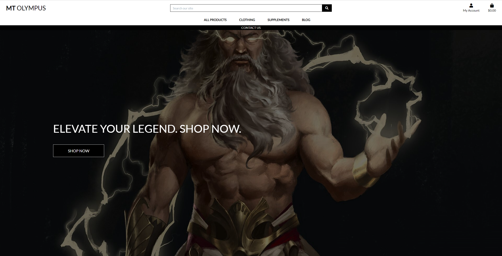

# Mt. Olympus

## Development Life Cycle

### Project Requirements

For my project, I’ll be using the following technologies:

* HTML, CSS, JavaScript: These are the building blocks for creating a user-friendly website.
* Python with Django: I’ll be diving into Django to build the backend of my project.
* Relational Database: I will be using PostgreSQL for efficient data storage.

My project will contain the following:

* My project will have a robust backend powered by a relational database. This will allow users to store and manipulate data related to a specific domain.
* My project will be organized into multiple apps. Each app will handle a potentially reusable component. 
* I’ll put some serious thought into designing my database schema. Relationships between entities will be carefully considered.
* I’ll implement an authentication mechanism. Users will register and log in for a good reason—like keeping their shopping cart intact between sessions.
* I’ll create forms with validation. Users can create and edit models in the backend. It’s all about making the user experience smooth.
* One of my Django apps will handle e-commerce functionality using Stripe. 
* My website will be well-organized, with clear navigation paths. No one wants to get lost in a digital maze!

### Data Handling

For my project, I opted for PostgreSQL, a powerful relational database. It allows me to efficiently store and manage structured data. With PostgreSQL, I can create tables, define relationships between them, and perform complex queries. It’s the backbone of my data storage, ensuring reliability and scalability.

### User Functionality

In my website, users have the power to explore the site. Here’s what they can do:

* Account Creation: Users can create their own accounts. A personalized corner of the site just for them, where they can view order history and update personal information for faster checkout.
* Log in/Log out: Once a user has created an account they can easily login and out at their own discretion.
* Basket: Logged-in users can add products to their baskets. 
* Stripe Checkout: Used for prompt payments.
* Contact Form: Any queries. Users or non-users have the ability to send an email with any questions they may have.

#### Project Superuser

The project Superuser has the ability to amend products and blog posts directly from the site. This has been carefully planned so only the superuser is able to CRUD. These features are hidden from shoppers.

### Structure

## What is Mt.Olympus

## Project Goals

## User Goals

## Research

|  |  |  |

### Key Takeaways

# Features

## User Stories

## User Story Testing

| **Feature** | **Expect** | **Action/Result** | 
| -------- | -------- | -------- |
|  | |  |

Screen Recording

| **Feature** | **Expect** | **Action/Result** | 
| -------- | -------- | -------- |
|  |  |  |

Screen Recording

| **Feature** | **Expect** | **Action/Result** | 
| -------- | -------- | -------- |
|  |  |  |

Screen Recording

| **Feature** | **Expect** | **Action/Result** | 
| -------- | -------- | -------- |
|  |  |  |

Screen Recording

| **Feature** | **Expect** | **Action/Result** | 
| -------- | -------- | -------- |
|  |   |  |

Screen Recording

## Future Features

# Design and Structure

## Structure

### Colors

### Languages Used

### Tools

* [Git](https://git-scm.com/)
Used for version control via GitPod by using the terminal to Git and Push to GitHub.
* [GitHub](https://github.com/)
Used to store the project code after being created in GitPod / Git.
* [Gitpod](https://www.gitpod.io/)
Used to create, edit & preview the project's code.
* [Heroku](https://www.heroku.com/)
Used to deploy the finished website.
* [ElephantSQL]()
* [AWS S3]()

# Testing

## HTML Validation

[HTML Validator](https://validator.w3.org/) The HTML pages were run through a HTML Validator.

HTML

## CSS Validation

[CSS Validator](https://jigsaw.w3.org/css-validator/) The CSS page was run through a CSS Validator.

Stylesheet

## Javascript Validation

[Javascript Validator](https://jshint.com/) The Javascript page was run through jshint.

JS

## Python Validation

[Python Validator](https://pep8ci.herokuapp.com/) The Python page was run through pep8 validator.

Python

## Responsiveness

The site was tested on the following devices:
* Asus Vivobook Book Pro 16"
* Samsung S23 Ultra
* Samsung S20
* Acer Chromebook 14"
* Google Developer tools. Utilizing all dimensions including the responsive option.

Dev Tools

## Deployment

### Step by step guide to deploying to Heroku
* I initiated the deployment process by creating a Heroku account.
* Prior to deployment, I prepared the project by creating essential configuration files. The requirements.txt file documented the project's dependencies, ensuring a seamless setup on Heroku. Additionally, the Procfile was crafted to specify the commands Heroku should execute to run the application.
* Navigating to the Heroku dashboard, I created a new application to serve as the deployment target.
* With the Heroku app in place, I connected it to my GitHub repository. This integration facilitated a streamlined deployment workflow, enabling automatic updates upon code changes.
* In the app's settings, I accessed the "Config Vars" section to securely manage environment variables. This step involved inputting sensitive information, such as API keys or database credentials, ensuring the secure functioning of the deployed application.
* I further enhanced the deployment process by configuring automatic deploys directly from my GitHub repository, by pushing requirements.txt and the Procfile.
* Each subsequent push to the branch, the application on Heroku updated, maintaining synchronization with the latest codebase.

### Step by step guide for ElephantSQL

### Step by step guide for AWS S3

## Credits

