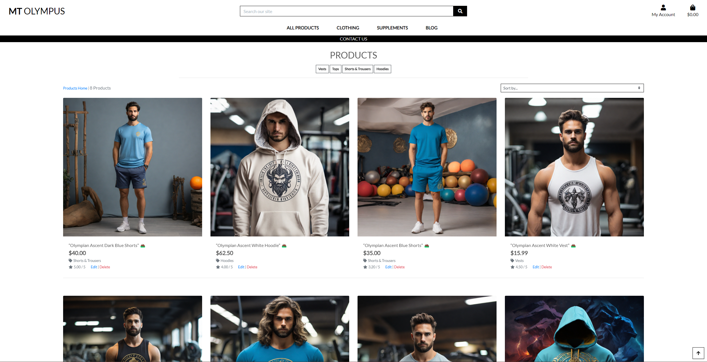
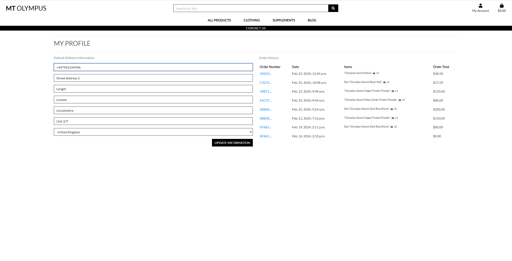

# Mt. Olympus

## Development Life Cycle

### Project Requirements

For my project, I’ll be using the following technologies:

* HTML, CSS, JavaScript: These are the building blocks for creating a user-friendly website.
* Python with Django: I’ll be diving into Django to build the backend of my project.
* Relational Database: I will be using PostgreSQL for efficient data storage.

My project will contain the following:

* My project will have a robust backend powered by a relational database. This will allow users to store and manipulate data related to a specific domain.
* My project will be organized into multiple apps. Each app will handle a potentially reusable component. 
* I’ll put some serious thought into designing my database schema. Relationships between entities will be carefully considered.
* I’ll implement an authentication mechanism. Users will register and log in for a good reason—like keeping their shopping cart intact between sessions.
* I’ll create forms with validation. The Superuser can create and edit models in the backend. It’s all about making the user experience smooth.
* One of my Django apps will handle e-commerce functionality using Stripe. 
* My website will be well-organized, with clear navigation paths. No one wants to get lost in a digital maze!

### Data Handling

For my project, I opted for PostgreSQL, a powerful relational database. It allows me to efficiently store and manage structured data. With PostgreSQL, I can create tables, define relationships between them, and perform complex queries. It’s the backbone of my data storage, ensuring reliability and scalability.

### User Functionality

In my website, users have the power to explore the site. Here’s what they can do:

* Account Creation: Users can create their own accounts. A personalized corner of the site just for them, where they can view order history and update personal information for faster checkout.
* Log in/Log out: Once a user has created an account they can easily login and out at their own discretion.
* Basket: Logged-in users can add products to their baskets. 
* Stripe Checkout: Used for prompt payments.
* Contact Form: Any queries. Users or non-users have the ability to send an email with any questions they may have.

#### Project Superuser

The project Superuser has the ability to amend products and blog posts directly from the site. This has been carefully planned so only the superuser is able to CRUD. These features are hidden from shoppers.

### Structure

A well-structured layout is integral to the project's design. Main navigation is prevelant on all screen sizes. Thus allowing seamless navigation to all areas of the site. Whether a user logged in, a user who hasn't registered or the site admin. The site provides navigation to the sections relevant to the applicable user.

## What is Mt.Olympus

Mt. Olympus isn’t just a mythical peak—it’s a thriving e-commerce haven! Imagine a place where users can ascend to new heights in style and wellness. Here’s the scoop:

1. Fashion Summit: At Mt. Olympus, shoppers can explore a wardrobe fit for gods and goddesses. From trendy clothing to timeless classics, we’ve got it all. Whether it’s Zeus-approved hoodies or Athena-inspired activewear, our virtual shelves are brimming with fashion treasures.
2. Supplement Sanctuary: But wait, there’s more! Our wellness section is like a sacred grove. Users can discover potent elixirs—protein powders, vitamins, and herbal blends—that fuel their inner demigod. It’s all about strength, vitality, and that immortal glow.
3. Shopping Altar: Expect the essentials: user-friendly navigation, product details, and a seamless checkout experience. Our shopping cart is like a chariot—swift and reliable. And yes, we accept offerings via Stripe for a divine transaction.
4. Oracle of Blog Posts: Stay in the loop with our blog. From supplements and events to celestial style guides, our posts are like scrolls from the gods themselves. Users can ascend to enlightenment while sipping their morning ambrosia.
So, whether you’re scaling the peaks of fashion or seeking wellness wisdom, Mt. Olympus awaits. 🏔️✨

## Project Goals

### User Accounts and Personalization:
* I will implement user account functionality. Users can create accounts, log in, and store personal information securely. 
### E-Commerce Experience:
* Shoppers will have a seamless experience. They can explore Mt. Olympus, add products to their baskets, and proceed to checkout. It’s all about making shopping divine.
### Blog Insights:
* The blog section will be a window into the world of Mt. Olympus. Users can stay updated on events, trends, and celestial musings. 
### User Authentication and Security:
* Implement robust user authentication to ensure a secure and personalized experience for our community members, safeguarding their profiles and interactions.
### User-Friendly CRUD Functionality: 
* Develop an intuitive and user-friendly interface for CRUD operations for the admin/superuser, making it easy to CRUD products and blog posts.

## User Goals

Mt. Olympus  is designed with our users in mind, aiming to provide an enriching and enjoyable experience. Here are the key user goals we strive to fulfill:

* Search Products: Whether navigating the site manually or using the search bar. Users can find and filter products with ease.
* Secure Checkout: Be able to checkout ensuring security and peace of mind during transactions.
* Stay in the know with the Blog: Get up to date/featured news, trends and insights.
* Find Inspiration: Outfits, Supplements and an array of fitness related content.

## Research

In regards to research I looked into e-commerce stores which provide the ability to search and purchase products.

| [Asos](https://www.asos.com/) | [Nike](https://Nike.com) | [Lacoste](https://www.lacoste.com/) |

### Key Takeaways

* Navigation: Mt.Olympus must allow users to seamlessly navigate to all sections of the website on any device.
* Visually appealing: Mt.Olympus must showcase all information/products in a uniform manner. With access to all information clearly visible and easy to read.
* Responsiveness: The site must work on all devices. Information must be formatted correctly on all sizes, prioritising mobile first design.
* Functionality: All actions must result in it's intended purpose.

# Features

## Main Navigation/Landing Page

1. Landing Page 
* The landing page serves as the central hub for users, providing comprehensive information about the site’s offerings, guiding visitors toward relevant sections and features.
2. Navigation and User Experience
* Mt. Olympus functions as a “Return to Home” link on screen sizes above tablet or 768px.
* Dropdown menus elegantly organize content, ensuring easy access to relevant pages.
* A user-friendly search bar empowers visitors to find specific products or keywords efficiently.
* The Shop Now button takes users straight to the products page acting as anpther way to access relevant pages.
3. User Account Management
* Links to the shopping basket and user accounts enhance convenience.
* The “My Account” section dynamically adjusts based on user status (registered, signed in, superuser, or regular user).

Landing Page

Dropdown

Search Bar

Shop Now

Bag

No account

Regular User

Superuser

## Product Pages

1. Product Overview
* The product page serves as a comprehensive catalog, displaying all available products within the store.
* Users can easily browse through the entire inventory.
* An overall product count provides transparency and context.
2. Sorting and Filtering 
* Users can refine their search by utilizing the sort-by feature.
* Multiple categories allow efficient filtering based on specific criteria (e.g., price, rating, category).
3. Enhanced User Experience 
* The inclusion of a “back to top” arrow enhances usability, especially for mobile users.
* Users no longer need to manually scroll to the top, resulting in a smoother navigation experience.

Products Page

Sorting

Back to top

### Product Detail

1. Individual Product Details
* Clicking on a specific product reveals an expanded view.
* Users gain access to detailed information about the product, including specifications, features, and any relevant descriptions.
* Clear calls-to-action, “add to bag” or “keep shopping,” guide users seamlessly through the store.

Product Detail

### Edit/Delete Product

1. Superuser/Admin Privileges
* Superusers and administrators enjoy additional functionality.
* Edit button provides direct access to edit product page.
* Clicking the delete button triggers a modal confirmation, ensuring intentional actions.

Edit Product

Delete Product

## Clothing Pages

1. Purpose and Functionality
* The Clothing Page serves a specific purpose within our platform.
* It acts as a targeted filter, displaying products exclusively categorized under clothing.
* It includes a convenient filter at the top, allowing users to narrow down their search within specific clothing categories. Categories such as vests, tops, shorts & trousers, and hoodies are easily accessible. This feature significantly enhances user navigation, especially when dealing with a large product inventory.
* Users can easily access a curated selection of clothing items.
2. User Experience Consistency
* The layout and presentation mirror that of the main product page.
* Users will find familiar features and functionality.
3. Superuser Capabilties
* Superusers benefit from the same level of control and management.
* Edit and delete actions are consistent across all product sections.

Clothing

## Supplements Pages

1. Purpose and Functionality
* Similar to the clothing section, the Supplements Pages offer a specialized view for products related to supplements. Just like before, users can utilize the convenient filter at the top to narrow down their search within specific supplement categories. Whether exploring snacks or protein powders, this consistent approach ensures an efficient and user-friendly experience.
2. Superuser Capabilties
* Superusers benefit from the same level of control and management.
* Edit and delete actions are consistent across all product sections.

Supplements

## Blog

1. Content Overview 
* The Blog section serves as an informative platform, offering detailed posts related to Mt. Olympus events, supplements, and clothing.
* Each blog post includes essential components:
    * Title: Clearly explains the topic of the post.
    * Slug: Identifies whether the post pertains to an event, supplement, or clothing.
    * Brief Overview: Provides a concise introduction to the content.
    * Main Content: Expansion upon the overview.
    * Thumbnail: Visual representation accompanying the post.
    * Author Attribution: Credits the author upon user interaction (clicking to read more).
    * Featured Checkbox: When checked, posts will display "Featured Post" and be ordered by featured posts first.
2. Content Management
* To maintain consistency and readability, blog post content is truncated using Django’s {{post.content|truncatewords:50}}.
* This ensures that blog posts do not exceed 50 words, creating a uniform appearance.
3. Enhanced Readability
* A modal with a “Read More” link allows users to access the complete blog post content.
* Django’s {{ post.content | linebreaks }} ensures legibility by formatting the text appropriately.
4. Superuser Capabilties
* Superusers have access to edit and delete buttons, mirroring the functionality seen in product pages.
5. Enhanced User Experience
* The inclusion of a “back to top” arrow maintains consistency across pages, enhancing navigation.

Blog

Read More Modal

Edit Blog

Delete Blog

Back to top

## Contact Form

1. Purpose and Accessibility
* The Contact Us link is prominently displayed across all pages, ensuring easy access for users.
* It serves as a direct channel for users to seek information and ask questions.
2. Consistent Styling
* The design of the contact form maintains uniformity with other forms on the site.
3. Form Fields:
    * Email: Users provide their email address for communication.
    * Subject: A concise summary of the inquiry or message.
    * Message: The main content of the communication.
* The form enforces completion of all fields; any missing information triggers an alert prompting users to fill out the required details.

Contact Us

Contatc Us Form

## Product/Blog Management 

1. Purpose and Functionality
* The Product/Blog Management pages serve a crucial role in content administration.
* These pages are accessible only to superusers, ensuring control over product and blog-related posts.
2. Unified Form Design
* The visual consistency of the forms reinforces a cohesive user experience.
* Whether adding a new product or creating a blog post, superusers encounter familiar styling.
3. Adding New Content
* Superusers utilize these forms to add fresh content to the platform.
* For products, relevant fields (such as title, description, price, etc.) are pulled from the forms.py file.
* Similarly, blog posts benefit from consistent data entry.
4. Access and Location 
* These management pages are discreetly placed under the “My Account” dropdown.
* Superusers can efficiently navigate to perform necessary tasks.
5. Django Crispy Forms
* The form creation process leverages Django Crispy Forms, ensuring clean and organized layouts.
* Superusers can confidently manage content without technical hurdles. 

Product/Blog Management

Product Management

Blog Management

## Profile/Register/Log in - Log out

### Register

1. Initial User Interaction
* Upon the user’s first visit to the site, they encounter two primary options under the “My Account” section: Register and Login.
* These options serve as gateways for users to create an account or access an existing one.
2. Register Page
* Navigating to the Register Page, users find a straightforward form.
* If the user already has an account, they can easily switch to the login page using the text link: “Already have an account? Then please sign in.”
* Alternatively, the “Back to Login” button provides a direct route to the login page.
3. Registration Process
* Users fill out the registration form, providing necessary details.
* After clicking “Sign Up,” they are directed to the Confirm Email Page.
* Here, users verify their email address, completing the registration process.
4. Form Validation 
* Form validation ensures that all required fields are filled out.
* If a user enters an email address that is already registered, a prompt informs them that an account exists and encourages them to log in.
5. User Experience and Security
* The seamless flow from registration to email confirmation enhances user experience.
* Security measures, such as email verification, protect user accounts.

Register

### Log In

1. Purpose and Context
* The Log In page serves as a gateway for users who already have profiles.
* It provides access to their accounts, allowing them to interact with personalized features.
2. User Interaction
* Users are prompted to fill in their email address and password.
* Clear instructions guide them through the process.
* Buttons for “Return to Home” and “Sign In” facilitate navigation.
3. Account Creation Reminder
* or users who haven’t created an account yet, a helpful message appears:
    * "If you have not created an account yet, then please sign up first."
* This encourages new users to register before attempting to log in.
4. Password Recovery Option
* A “Forgot Password?” link provides a convenient way for users to reset their password.
* Clicking this link directs them to the Forgot Password Page, where they can initiate the recovery process.

Log In

### Log Out

1. Clear Purpose
* The Log Out feature performs exactly as its name suggests: it allows users to sign out of their accounts.
* It ensures that users can securely end their session when they no longer need access.
2. User Interface Changes
* After logging in, the options under “My Account” shift to My Profile and Logout.
3. Logout Process
* When users click Logout, they are directed to a confirmation page:
    * Sign Out: This action immediately logs them out.
    * Cancel: If they change their mind, clicking this button returns them to the home page.

Log Out

## Profile

1. Access and Purpose
* Upon registering or logging in, users gain access to their personalized profile page.
* is page serves as a central hub for managing account-related information.
2. Delivery Information Update
* Users can conveniently update their delivery information directly on this page.
* Any changes made here will automatically populate the relevant fields during the checkout process.
* This streamlines the checkout experience, making it faster and more efficient.
3. Order History
* The profile page displays a comprehensive order history.
* Users can review details of their previous orders, including items purchased, dates, and order totals.
* Clicking on a specific order provides additional information, order details and address.

Profile

## Bag

1. Product Aggregator
* The shopping bag diligently collects all the items you add to your basket.
* It holds crucial information about each product.
2. Quantity Management
* Within the bag, you’ll find a convenient quantity tab for each item.
* Users can easily update quantities directly in the basket.
* Whether adding more or reducing quantities, a simple click on the update button ensures accurate adjustments.
* A handy pop-up confirms the changes, keeping you informed about the updated bag contents.
3. Item Removal Option
* Users have the flexibility to remove items from their basket.
* A straightforward remove button ensures a clutter-free shopping experience.
4. Checkout
* When you’re ready to proceed, two options await:
    * “Secure Checkout”: This leads you to the next step, where you provide essential details for a smooth transaction.
    * “Keep Shopping”: If you want to explore more, this button keeps your bag intact while you continue browsing.
5. Secure Checkout Process
* Users are prompted to fill out essential fields such as name, email, and delivery address.
* If any adjustments are needed, the “Adjust Bag” link allows you to return to the bag page.
* For registered users, pre-filled information speeds up the process.
* Finally, when it’s time to pay, Stripe handles the payment securely.

Bag

Checkout

## Toasts

1. Purpose and Context
* Toasts serve as unobtrusive notifications.
* They appear at the top of the screen, to inform users about actions they’ve taken or system responses.
2. User Actions
* Actions such as logging in or out.
* Adding items to the bag.
* Sucess toasts.
* Superuser toasts for editing products etc.
3. User-Centric Approach
* Toasts prioritize user awareness and feedback.
* They create a sense of accomplishment (e.g., successful login) or provide essential information (e.g., order confirmation).
4. Examples

Examples

These are just a few examples of the many toats that await when performing actions throughout the site!

## User Stories

1. User Registration
* As a user, I want the option to register for a profile. I expect this registration process to streamline my future interactions on the site.
2. Product Exploration
* As a user, I want to browse a variety of products. I need detailed information about each product to make informed decisions.
3. Efficient Navigation and Search
* I expect easy navigation throughout the site. A robust search capability will help me find specific products quickly.
4. Bag Management 
* As a user, I want to add, update, and remove products from my basket. A smooth experience ensures efficient shopping.
5. Contact and Support
* I want the ability to contact Mt. Olympus with any questions or inquiries. Clear communication channels are essential.
6. Seamless Checkout Process
* I expect a smooth checkout process when making a purchase. Clear steps and secure handling of my information are crucial.
7. Stay Informed
* I want to stay up to date with events, promotions, and news related to Mt. Olympus. Regular updates keep me engaged and informed.

## User Story Testing

| **Feature** | **Expect** | **Action/Result** | 
| -------- | -------- | -------- |
|  User registration form. | Users can create an account by providing their email, password, and other relevant details. | User fills out the registration form. Clicks the “Sign Up” button. User then confirms emails. Can now log in using the registered credentials. |

| **Feature** | **Expect** | **Action/Result** | 
| -------- | -------- | -------- |
| Product Exploration | View a list of products with relevant details (name, price, image). | User navigates to the product listing page. User clicks on a product to view its details. User is provided all the relevant information.|

| **Feature** | **Expect** | **Action/Result** | 
| -------- | -------- | -------- |
| Efficient Navigation and Search | I expect items to be filtered down to my search results or shown in a way I have filtered. | Navigate to products page and use the search bar. Products matching that word will be shown below. Items filtered using the sort-by feature will be shown depending on the filter the user has clicked. |

| **Feature** | **Expect** | **Action/Result** | 
| -------- | -------- | -------- |
| Bag Management  | Items added to basket to be shown within the bag with all relevant information, especially quantities. | Items added to the bag via "add to bag" are shown in the order they were added, along with quantities and the abilty to update or remove. |

| **Feature** | **Expect** | **Action/Result** | 
| -------- | -------- | -------- |
| Contact and Support |  I expect a contact form to be provided for any queries I may have. | Contact Us. Is prevelant across all pages. Upon clicking contact us the user is prompted to fill in the form, where a toast will display, saying their message was succesfully sent. |

| **Feature** | **Expect** | **Action/Result** | 
| -------- | -------- | -------- |
| Seamless Checkout Process | I expect an easy, streamlined checkout process. | If a user has a profile the checkout form will mostly be pre filled, streamlining the process. The information needs to be filled out along with a card to submit payment. Once submitted payment is taken and the order is placed. |

| **Feature** | **Expect** | **Action/Result** | 
| -------- | -------- | -------- |
| Blog | I expect to be kept upto date with information regarding Mt. Olympus. | Navigating to the Blog page, users are displayed with posts regarding Mt.Olmypus. |

## Future Features

Future features I plan to include are:
* Comment section for Blog Posts and products.
    * Thus enhancing user experience and building a community around the brand.
    * Also allowing new users to get a feel for products before they purchase.
* Wishlist or Favorites:
    * Allow users to create a wishlist or mark favorite products.
    * sers can save items they’re interested in for future reference.

# Design and Structure

## Structure

1. Landing page:
* The landing page serves as the initial entry point for users. It provides an overview of Mt. Olympus, introducing the brand and key offerings.
2. Product Pages:
* These pages showcase the range of products available on Mt. Olympus. Users can explore clothing items and supplements. Each product listing includes relevant details (name, price, image).
3. User Profile Page
* Upon registration or login, users gain access to their personalized profile page. Here, they can manage account details, including delivery information and order history.
4. Contact Form 
* The contact form allows users to reach out to Mt. Olympus with inquiries, questions, or feedback. Users can provide their email, subject, and message.
5. Blog Posts
* The blog section features informative posts related to Mt. Olympus events, products, and lifestyle. Users can read articles.
6. Authentication and Checkout
* Authentication pages handle user registration, login, and logout. The checkout process guides users through secure payment and order placement.

### Colors

1. Black:
    * Black is a powerful and timeless color. It conveys sophistication, elegance, and authority.
    * By using black as a dominant color, you create a strong visual impact.
    * In the context of Mt. Olympus, black provides a sleek and modern aesthetic.
2. White: 
    * White serves as an excellent contrast to black. It represents purity, simplicity, and cleanliness.
    * White backgrounds enhance readability, allowing product images and blog posts to stand out.
    * he combination of black and white creates a classic and minimalist look.
3. Contrast and Focus:
    * By keeping the main content areas (products, blog posts) in black on a white background, you ensure that users’ attention is drawn to these crucial sections. The high contrast aids readability and visual hierarchy.

Black and White were the mian colors used. These provide great contrast and aid readbailtiy. This also allows product images and blog posts to pop. These are the main areas users will be spending their time so making them the centre of attention was our priotity.

### Languages Used

### Tools

* [Git](https://git-scm.com/)
Used for version control via GitPod by using the terminal to Git and Push to GitHub.
* [GitHub](https://github.com/)
Used to store the project code after being created in GitPod / Git.
* [Gitpod](https://www.gitpod.io/)
Used to create, edit & preview the project's code.
* [Heroku](https://www.heroku.com/)
Used to deploy the finished website.
* [ElephantSQL](https://www.elephantsql.com/)
Used to store site data.
* [AWS S3](https://aws.amazon.com/s3/)
Used to store media files used for Mt.Olympus.

# Testing

## HTML Validation

[HTML Validator](https://validator.w3.org/) The HTML pages were run through a HTML Validator.
All HTML was put through the above validator, with Django being removed where applicable and tested. Git push were performed when files were being commented upon and validated.

## CSS Validation

[CSS Validator](https://jigsaw.w3.org/css-validator/) The CSS page was run through a CSS Validator.
All CSS was put through the above validator. Git push were performed when files were being commented upon and validated.

## Javascript Validation

[Javascript Validator](https://jshint.com/) The Javascript page was run through jshint.
All JS was put through the above validator. Git push were performed when files were being commented upon and validated.

## Python Validation

[Python Validator](https://pep8ci.herokuapp.com/) The Python page was run through pep8 validator.
All Python was put through the above validator. Git push were performed when files were being commented upon and validated. All files were made PEP8 compliant, making sure functionality remained.

## Responsiveness

The site was tested on the following devices:
* Asus Vivobook Book Pro 16"
* Samsung S23 Ultra
* Samsung S20
* Acer Chromebook 14"
* Google Developer tools. Utilizing all dimensions including the responsive option.

## Deployment

### Step by step guide to deploying to Heroku
* I initiated the deployment process by creating a Heroku account.
* Prior to deployment, I prepared the project by creating essential configuration files. The requirements.txt file documented the project's dependencies, ensuring a seamless setup on Heroku. Additionally, the Procfile was crafted to specify the commands Heroku should execute to run the application.
* Navigating to the Heroku dashboard, I created a new application to serve as the deployment target.
* With the Heroku app in place, I connected it to my GitHub repository. This integration facilitated a streamlined deployment workflow, enabling automatic updates upon code changes.
* In the app's settings, I accessed the "Config Vars" section to securely manage environment variables. This step involved inputting sensitive information, such as API keys or database credentials, ensuring the secure functioning of the deployed application.
* I further enhanced the deployment process by configuring automatic deploys directly from my GitHub repository, by pushing requirements.txt and the Procfile.
* Each subsequent push to the branch, the application on Heroku updated, maintaining synchronization with the latest codebase.

### Issues/Solutions to coding problems.

1. Bag Refactor:

* During the process of refactoring the bag component for smaller screen sizes, I encountered a significant issue. While the refactor successfully resolved side-scrolling problems on mobile screens, it inadvertently introduced a functionality issue related to bag item decrements on larger screens.

* My initial attempt involved changing the quantity form IDs to classes and refactoring the JavaScript code accordingly. Unfortunately, this approach did not yield the desired results. Next, I implemented a custom quantity input script specifically for the bag app, but this also failed to address the issue.

* Seeking assistance from tutor support proved unfruitful, and my inquiries to classmates and group tutors via Slack went unanswered. Even after experimenting with additional adjustments, such as adding Bootstrap classes and applying CSS, the functionality issue persisted.

* Ultimately, I made an executive decision to prioritize functionality over visual perfection and retained the existing behavior, despite the remaining visual bug.

2. Connecting db.sqlite3 to ElephantSQL

* I Created a file named env.py in the root directory of my project. This is the file I defined my environment variables.
* Added env.py to gitignore to stop it pushing sensitive data to GitHub.
 
* At the top of the env.py  file, I imported os so I could set the environment variables in the operating system. Once I added the line “import os” underneath I assigned my environment variables using the following syntax: 
    * bos.environ["Variable Name Here"] = "Value of Variable Goes Here" 
    * Example: os.environ["SECRET_KEY"] = "ohsosecret" 
* Then the following code imports this new env.py file where I used my environment variables. 
* After adding this under your other imports at the top of the file: 
    * import os
    * if os.path.exists("env.py"):
    * import env 
* The if statement here is so that the env.py file is only pulled when working on your code in your workspace, not when it is deployed on heroku. 
* For deployment I set my environment variables in the heroku dashboard in settings > config vars.
* Now that my environment variables have been set in my env.py file, and the file has been imported into my project, I used them as needed using the following syntax: 
    * SECRET_KEY = os.environ.get('SECRET_KEY')
* Next I ran migrations. 
* To transfer from db.sqlite3 to ElephantSQL I run backup:

    * python3 manage.py dumpdata --exclude auth.permission --exclude contenttypes > elephantsql.json 
    * commented out DATABASE_URL in env.py and ran
    * python3 manage.py dumpdata --exclude auth.permission --exclude contenttypes > sqlite.json
    * next I uncommented DATABASE_URL and ran
    * python3 manage.py loaddata sqlite.json which had a problem installing the fixture. To resolve this I reset my elephantSQL database.
    * Then I run python manage.py migrate then python3 manage.py loaddata sqlite.json

* Which led to another issue where I had to remove the admin logs from the json file to which I recieved Installed 43 object(s) from 1 fixture(s). Thus connecting my databases.

3. Testing Stripe
* When it came to testing Stripe. After setting it all up. Stripe provides a test card:
    * 4242 4242 4242 4242
* Any number can be used for:
    * MM/YY
    * CVC
    * ZIP
* Upon submitting payment I navigated over to Stripe where you can see payments have been succesful.

Stripe Success

## Credits
* Credits go to Code Institute for providing a detailed walkthrough to Django and it's capabilities. Providing links to Django documentation to build and understand how a web application can easily be built, linking views, urls etc.
* I also used an online tutorial as the basis for the [Contact Form](https://learndjango.com/tutorials/django-email-contact-form-tutorial). This taught me how to set up the forms.py and link the relevant views and urls to create a contact form which, when submitted it succesfully shown to the terminal.
* For the [Blog] (https://realpython.com/build-a-blog-from-scratch-django/) I used this site as a reference. This gave me the basic structure and functionailty. I then expanded on the Blog using the products app adding Django features such as {{ post.content | linebreaks }} and {{ post.content|truncatewords:50 }} to aid readability and create a uniform layout. 
* Product images were created by using prompts via [Leonardo.Ai](https://leonardo.ai/). This allowed me to create copyright free imagery for my site.